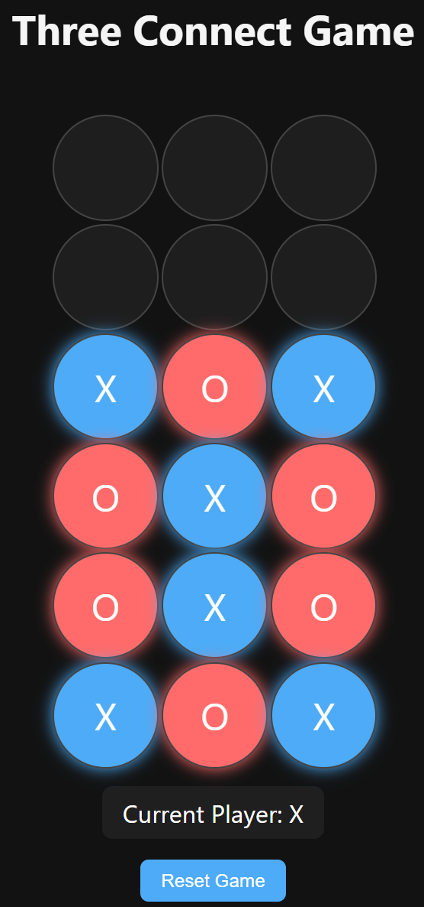
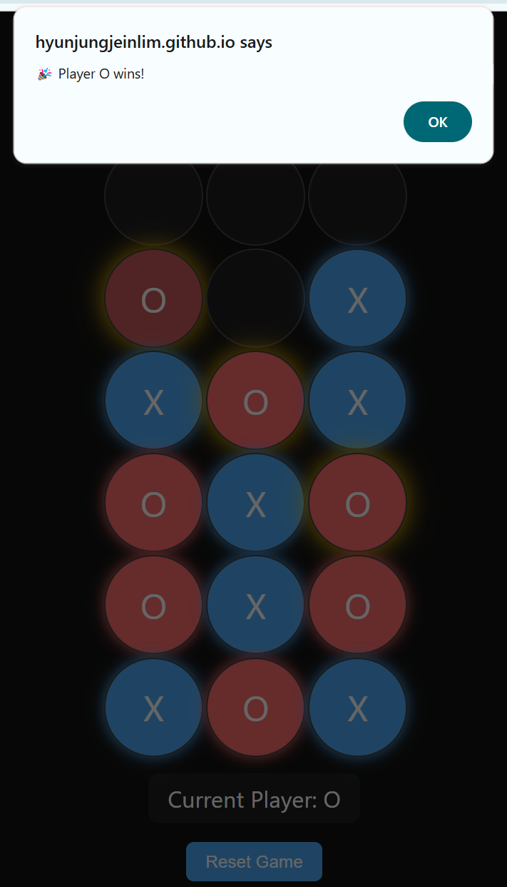

# Three Connect Game

🖼️ preview images of the game

📋 Description

Three Connect is a lightweight web-based game where two players compete to connect three matching pieces in a row - vertically, horizontally, or diagonally. 
It is developed using vanilla HTML, CSS, and JavaScript with smooth animations and responsive UI, designed for browser-based gameplay.

✨ Features

- 6 rows × 3 columns grid game board
- Two-player turn-based system (Player X and Player O)
- Win detection in all directions (vertical, horizontal, diagonal)
- Winning cells are highlighted with blinking animation
- Reset button to restart the game
- Responsive design and clean interface for web browsers
- Entry animation when loading the game

🚀 How to Play

1. Click on a cell to drop your piece in the selected column.
2. Take turns between Player X and Player O.
3. The first player to connect 3 pieces in a row (in any direction) wins.
4. Press the **Reset Game** button to start over.
